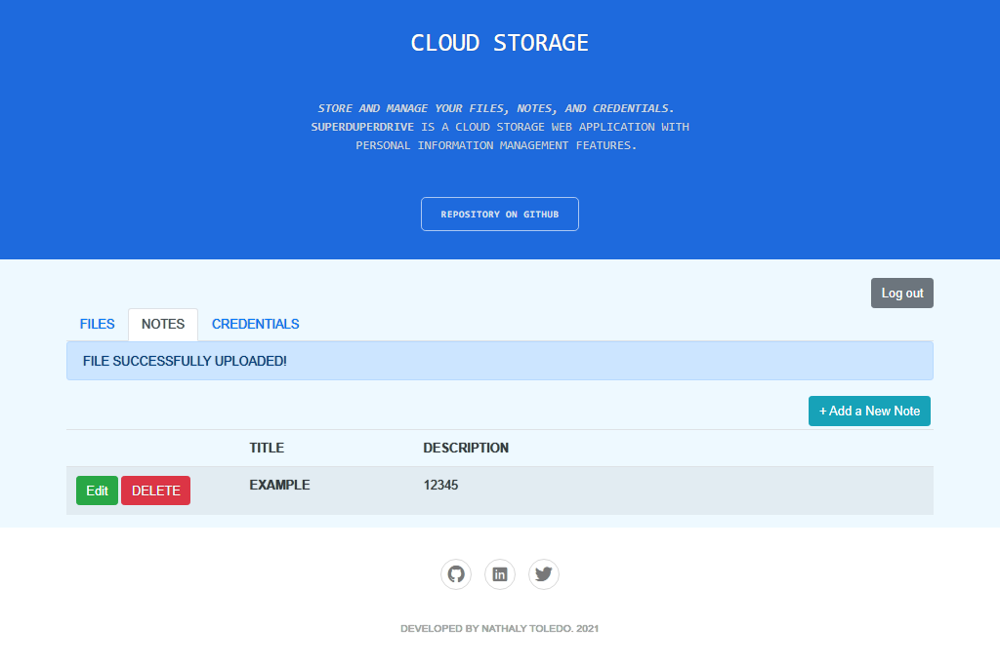

# SuperDuperDrive Cloud Storage
### _Store and manage your files, notes, and credentials_



It is a cloud storage web application with personal information management features. The system includes three user-facing features:
1.	Simple File Storage: upload/download/remove files
2.	Note Management: add/update/remove text notes
3.	Password Management: save, edit, and delete website credentials.

## Features
The layers of the application:
•	The back-end with Spring Boot.
•	The front-end with Thymeleaf.
•	Application tests with Selenium.

### The Back-End
Security features and connecting the front-end to database data and actions. The app covers:
•	Managing User Access with Spring Security.
•	Handling Front-End Calls with Controllers.
•	Making Calls to the Database with MyBatis Mappers.

### The Front-End
Graphical interfaces the user can interact with:
#### 1. Login Page
•	Everyone can access this page.
•	Shows login errors, like invalid username/password.

#### 2. Signup Page
•	Everyone can access this page.
•	Validates that the username supplied does not already exist in the application.

#### 3. Home Page
•	The home page is the center of the application and hosts the three required pieces of functionality. The web page presents them as three tabs that can be clicked through by the user:

**i. Files**
•	The user can upload files and see any files they previously uploaded.
•	The user can view/download or delete previously-uploaded files.
•	The user can’t upload two files with the same name, or upload files larger than 5MB.

**ii. Notes**
•	The user can create, view, edit and delete previously-created notes.

**iii. Credentials**
•	The user can store credentials for specific. The passwords stored in the database are encrypted and only decrypted to be updated by the respective client. 
•	The user can create, view, edit and delete previously-created notes.

### Testing
Selenium tests to verify user-facing functionality and prove that the code is feature-complete were written. There are:
1.	Tests for user registration, login, and unauthorized access restrictions.
2.  Tests for note creation, viewing, editing, and deletion.
3. Tests for credential creation, viewing, editing, and deletion.

## Tech

The app uses different frameworks, dependencies, languages, and tools to work properly. Main technologies:

- [Java] - object-oriented programming language
- [Spring Boot] -  an application framework and inversion of control container 
- [Thymeleaf] - a Java XML/XHTML/HTML5 template engine 
- [Selenium] - a portable framework for testing web applications
- [Bootstrap] -  a free and open-source CSS framework
- [MyBatis] - a Java persistence framework that couples objects with stored procedures 

## Installation
### Required
- A text editor or IDE
- JDK 1.8 or later
- Gradle 4+ or Maven 3.2+

Clone this repository and import it into your preferred IDE for Java (such as Eclipse or IntelliJ).
```
https://github.com/ahn-nath/Cloud-Storage-Java-Spring-Boot.git
```
Find the main class in the package explorer section and run it.
The main class starts the Spring ApplicationContext:
[CloudStorageApplication.java](https://github.com/ahn-nath/Cloud-Storage-Java-Spring-Boot/blob/main/src/main/java/com/udacity/jwdnd/course1/cloudstorage/CloudStorageApplication.java)


When the application runs successfully, you will get a message in the console with an URL to follow. Open the browser and invoke the URL:
```
http://localhost:8080.
```

**Any feedback is always welcome!**

[//]: # (These are reference links used in the body of this note and get stripped out when the markdown processor does its job.)

   [Java]: <https://www.java.com/>
   [Spring Boot]: <https://spring.io/projects/spring-boot>
   [Thymeleaf]: <https://www.thymeleaf.org/>
   [Selenium]: <https://www.selenium.dev//>
   [Bootstrap]: <https://getbootstrap.com/>
   [MyBatis]: <https://mybatis.org/mybatis-3/>

    
